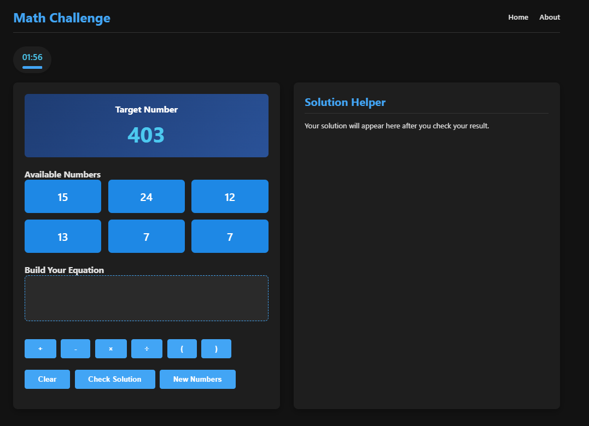
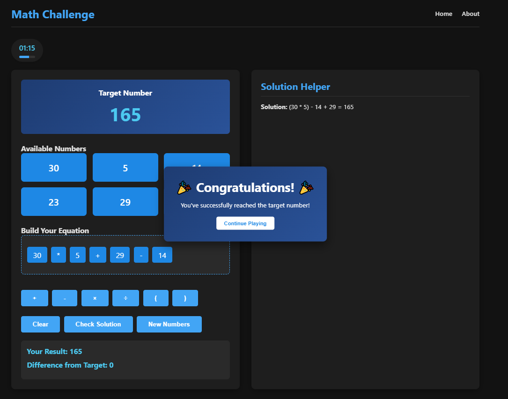
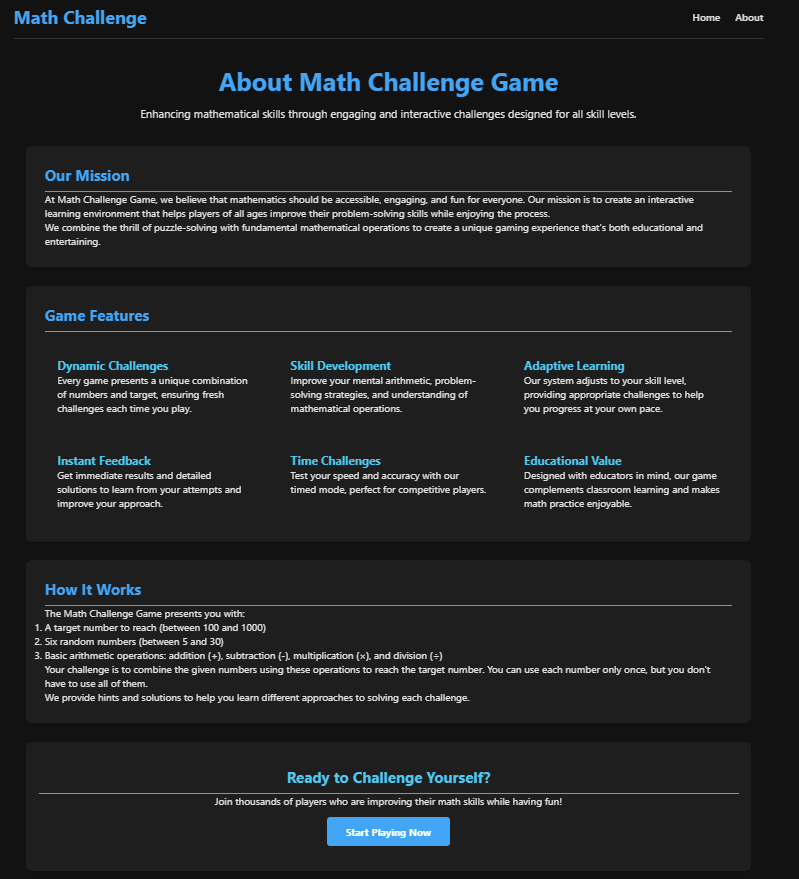

# 🧮 Math Challenge Game

A fun and interactive web-based math puzzle game where players use numbers and operations to reach a target value. Built with Flask, JavaScript, and CSS. The game offers an engaging way to enhance mathematical skills while providing an intuitive and visually appealing interface.

## ✨ Features

- 🎯 **Dynamic Challenges** – Randomly generated target numbers and number sets ensure unique gameplay every time.
- ⏳ **Timed Mode** – Complete challenges before time runs out, with a visual progress indicator that adjusts dynamically.
- 🧩 **Drag-and-Drop Gameplay** – Build equations intuitively by dragging numbers and placing them in the correct order.
- ✅ **Real-Time Validation** – Instantly check if your equation solves the challenge with on-screen feedback.
- 💡 **AI-Powered Hints** – Get smart suggestions using the OpenAI API, with adaptive difficulty levels based on your progress.
- 🏆 **Victory Celebrations** – Animated effects and sound effects when you reach the target number to make solving equations more rewarding.
- 🔄 **Endless Replayability** – Generate new number sets anytime for continuous learning and fun.
- 📱 **Responsive Design** – Works smoothly on desktops, tablets, and mobile devices, with touch-friendly interactions.

## 🛠️ Technologies Used

- **Backend**: Python (Flask) with optimized API calls for faster responses.
- **Frontend**: HTML5, CSS3, JavaScript with enhanced UI animations.
- **AI Integration**: OpenAI API (GPT-3.5) for dynamic and context-aware hints.
- **Styling**: Custom CSS with CSS variables, optimized for better readability and accessibility.

## Screenshots
- Home page 
- Game Completion 
- About us    

## 🚀 Installation & Setup

Follow these steps to set up the game on your local machine:

1. **Clone the repository**:
   ```bash
   git clone https://github.com/yourusername/math-challenge-game.git
   cd math-challenge-game
   ```

2. **Create and activate a virtual environment**:
   ```bash
   python -m venv venv
   source venv/bin/activate  # On Windows: venv\Scripts\activate
   ```

3. **Install dependencies**:
   ```bash
   pip install -r requirements.txt
   ```

4. **Set up environment variables**:
   ```bash
   echo "OPENAI_API_KEY=your_api_key_here" > .env
   ```

5. **Run the application**:
   ```bash
   flask run
   ```

6. **Open your browser and play**:
   ```
   http://localhost:5000
   ```

## ⚙️ Configuration

Modify `app.py` to customize the game settings:
- Adjust difficulty (number range & targets) to suit different skill levels.
- Change the timer duration for more or less challenge.
- Tweak OpenAI model parameters for hints to provide more accurate and user-friendly suggestions.

## 🎮 How to Play

1. A target number and six available numbers are displayed.
2. Drag numbers into the equation builder to construct an equation.
3. Use operation buttons (+, -, ×, ÷) to form a valid mathematical expression.
4. Add parentheses for complex operations if needed.
5. Click **"Check Solution"** to validate your equation and receive instant feedback.
6. Try to match the target number exactly to win the challenge!

## 📂 Project Structure

```
math-challenge-game/
├── static/
│   ├── script.js       # Game logic and interactions
│   └── style.css       # Game styling, optimized for smooth animations
├── templates/
│   ├── base.html       # Base template with improved UI elements
│   ├── index.html      # Main game page with interactive elements
│   ├── about.html      # About page with additional details
├── Assets/
│   ├── Example1.PNG    # Screenshot of the home page
│   ├── Example2.PNG    # Screenshot of game completion
│   └── Example3.PNG    # Screenshot of the about page
├── app.py              # Flask application with improved request handling
└── README.md           # This file
```
